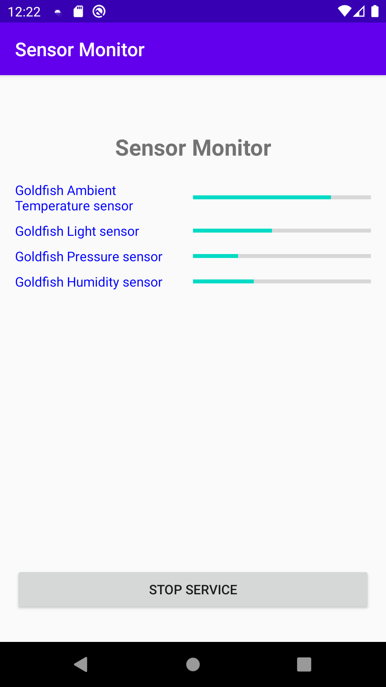
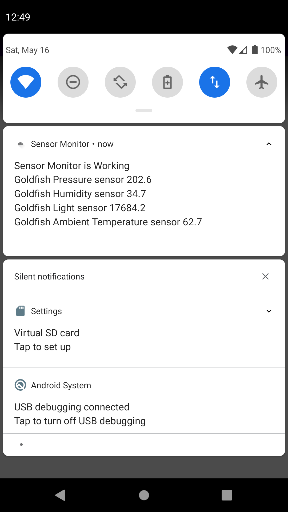
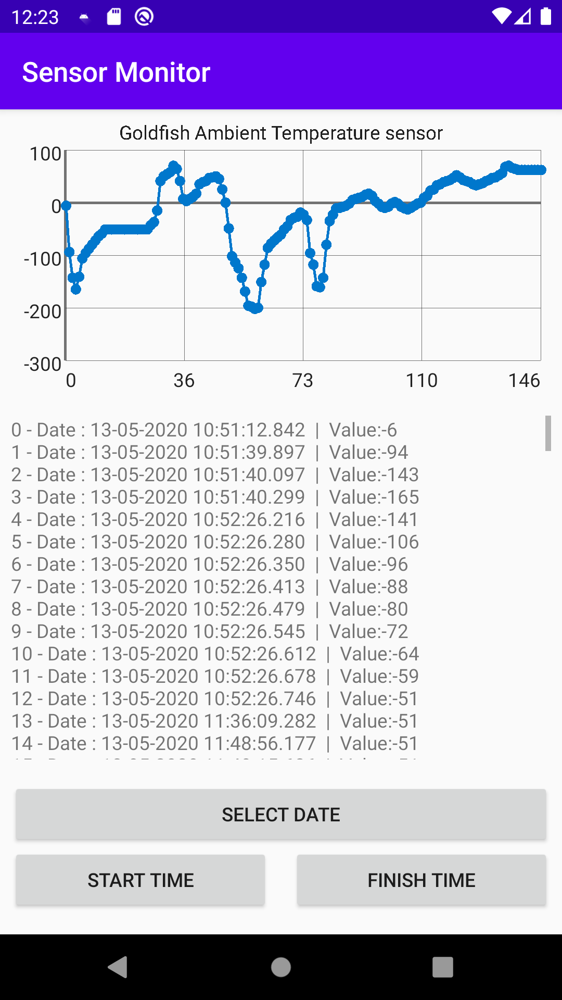
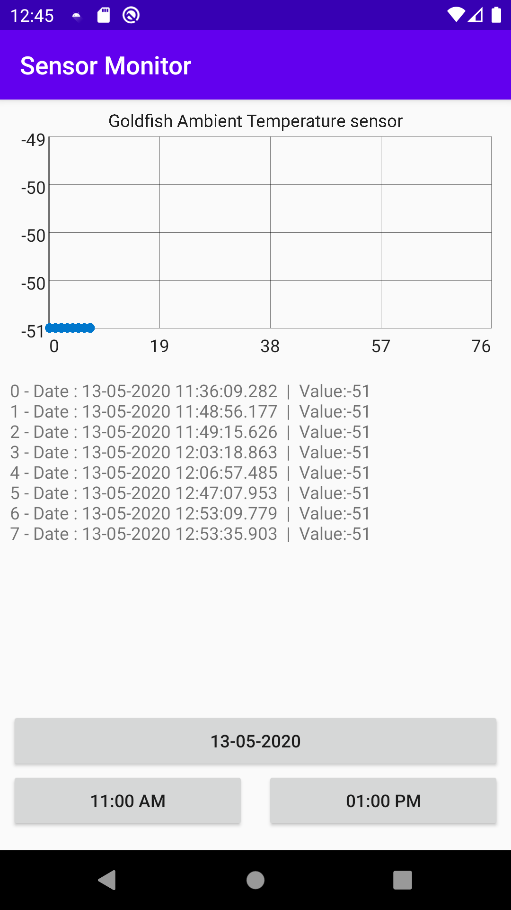

# Sensor Monitor For Android

Simple "environment" sensor monitor app for android. Includes a service for listen environment sensors. Records sensor changes into database. User can see old sensor data on chart by clicking on the sensor name. The plus of this project is almost everything dynamic. You can add new sensor by adding type on SENSOR_TYPES array in SystemSensorManager class. But if you want 3-Dimensional sensor you must do more work. Sensor manager gets only first sensor data. This is a simple project for general use.

## Screen Shots

## License
[MIT](https://choosealicense.com/licenses/mit/)
